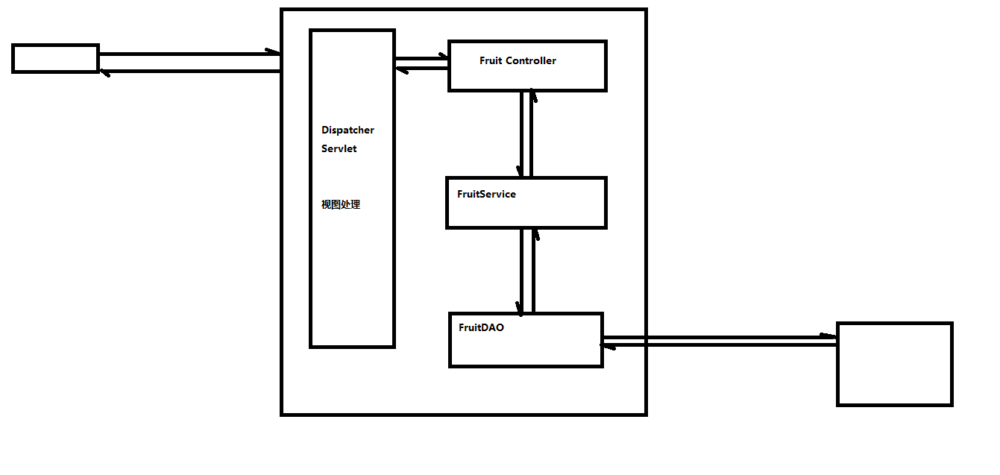

## 1 再次学习Servlet的初始化方法

### 1.1 Servlet生命周期：实例化、初始化、服务、销毁

### 1.2 组件配置：ServletConfig 

生效范围：当前组件可用

#### 1.2.1 使用配置

Servlet中的初始化方法有两个：init() , init(config)

其中带参数的方法代码如下：
public void init(ServletConfig config) throws ServletException {
      this.config = config ;
      init();
 }
 另外一个无参的init方法如下：
 public void init() throws ServletException{
 }
 如果我们想要在Servlet初始化时做一些准备工作，那么我们可以重写init方法
 我们可以通过如下步骤去获取初始化设置的数据

   - 获取config对象：ServletConfig config = getServletConfig();
   - 获取初始化参数值： config.getInitParameter(key);

#### 1.2.2 添加配置

在web.xml文件中配置Servlet

<servlet>
    <servlet-name>Demo01Servlet</servlet-name>
    <servlet-class>com.atguigu.servlet.Demo01Servlet</servlet-class>
    <init-param>
        <param-name>hello</param-name>
        <param-value>world</param-value>
    </init-param>
    <init-param>
        <param-name>uname</param-name>
        <param-value>jim</param-value>
    </init-param>
</servlet>
<servlet-mapping>
    <servlet-name>Demo01Servlet</servlet-name>
    <url-pattern>/demo01</url-pattern>
</servlet-mapping>

  3) 也可以通过注解的方式进行配置：
     @WebServlet(urlPatterns = {"/demo01"} ,
     initParams = {
         @WebInitParam(name="hello",value="world"),
         @WebInitParam(name="uname",value="jim")
     })

### 1.3 应用上下文配置：ServletContext

生效范围：当前整个应用内可用。

学习Servlet中的ServletContext和<context-param>

1) 获取ServletContext，有很多方法
   在初始化方法中： ServletContxt servletContext = getServletContext();
   在服务方法中也可以通过request对象获取，也可以通过session获取：
   request.getServletContext(); session.getServletContext()
2) 获取初始化值：
   servletContext.getInitParameter();

## 2 什么是MVC

### 2.1 背景

#### 2.1.1 繁重的Controller

之前的代码中，直接在Controller里写dao代码，简单项目没有关系。但是如果业务复杂，Controller类里出现大量的业务代码，职责负担就过重了。

#### 2.1.2 Model1和Model2

Model1【比如JSP，特点是html和java代码掺杂在一起】开发速度快，适合简单的小项目。Model2更规范，适合构建更健壮、扩展性更好的大项目。
  现在一般都用Model2【即MVC】。

### 2.2 认识MVC 

经过上面分析，我们如何给Controller类减负呢？

我们重新明确Controller类的职责，对Controller的定位是一个决策者角色，不再负责具体的业务操作。

- 由哪个Model处理当前请求
- 数据呈现方式【视图渲染，JSON等】
- 是否需要重定向或内部转发

我们引入一个新的角色，Model（模型），负责具体的复杂的业务操作。

MVC : Model（模型）、View（视图）、Controller（控制器）
  视图层：用于做数据展示以及和用户交互的一个界面
  控制层：能够接受客户端的请求，并调度正确的视图和业务模块，来完成用户请求处理。担当门户功能，并且协调内部模块共同完成请求。
  模型层：模型分为很多种：有比较简单的pojo/vo(value object)，数据访问模型（DAO）；业务逻辑模型（BO）；数据传输对象（DTO）

      1) pojo/vo : 值对象
      2) DAO ： 数据访问对象
      3) BO ： 业务对象

   4) 区分业务对象和数据访问对象：

    1） DAO中的方法都是单精度方法或者称之为细粒度方法。什么叫单精度？一个方法只考虑一个操作，比如添加，那就是insert操作、查询那就是select操作....
    2） BO中的方法属于业务方法，也实际的业务是比较复杂的，因此业务方法的粒度是比较粗的
      注册这个功能属于业务功能，也就是说注册这个方法属于业务方法。
      那么这个业务方法中包含了多个DAO方法。也就是说注册这个业务功能需要通过多个DAO方法的组合调用，从而完成注册功能的开发。
      注册：
            1. 检查用户名是否已经被注册 - DAO中的select操作
            2. 向用户表新增一条新用户记录 - DAO中的insert操作
            3. 向用户积分表新增一条记录（新用户默认初始化积分100分） - DAO中的insert操作
            4. 向系统消息表新增一条记录（某某某新用户注册了，需要根据通讯录信息向他的联系人推送消息） - DAO中的insert操作
            5. 向系统日志表新增一条记录（某用户在某IP在某年某月某日某时某分某秒某毫秒注册） - DAO中的insert操作
            6. ....
   5) 在库存系统中添加业务层组件

## 3 IOC

1) 耦合/依赖
    依赖指的是某某某离不开某某某
    在软件系统中，层与层之间是存在依赖的。我们也称之为耦合。
    我们系统架构或者是设计的一个原则是： 高内聚低耦合。
    层内部的组成应该是高度聚合的，而层与层之间的关系应该是低耦合的，最理想的情况0耦合（就是没有耦合）
2) IOC - 控制反转 / DI - 依赖注入

    控制反转：
    1) 之前在Servlet中，我们创建service对象 ， FruitService fruitService = new FruitServiceImpl();
       这句话如果出现在servlet中的某个方法内部，那么这个fruitService的作用域（生命周期）应该就是这个方法级别；
       如果这句话出现在servlet的类中，也就是说fruitService是一个成员变量，那么这个fruitService的作用域（生命周期）应该就是这个servlet实例级别
    2) 之后我们在applicationContext.xml中定义了这个fruitService。然后通过解析XML，产生fruitService实例，存放在beanMap中，这个beanMap在一个BeanFactory中
       因此，我们转移（改变）了之前的service实例、dao实例等等他们的生命周期。控制权从程序员转移到BeanFactory。这个现象我们称之为控制反转
    
    依赖注入：
    1) 之前我们在控制层出现代码：FruitService fruitService = new FruitServiceImpl()；
       那么，控制层和service层存在耦合。
    2) 之后，我们将代码修改成FruitService fruitService = null ;
       然后，在配置文件中配置:
       <bean id="fruit" class="FruitController">
            <property name="fruitService" ref="fruitService"/>
       </bean>

通过IOC，DI，反射技术，我们实现了完全意义上的**依赖倒置原则**。高层与低层模块都依赖接口，互相不认识对方。

5. 过滤器Filter
6. 事务管理
7. TransActionManager、ThreadLocal、OpenSessionInViewFilter