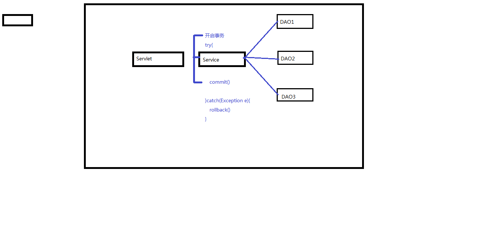
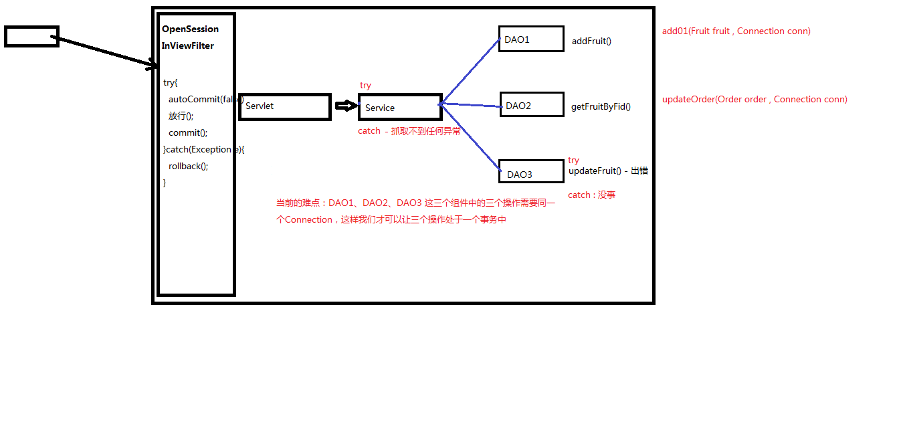

今日内容：
    1. 过滤器Filter
        2. 事务管理(TransactionManager、ThreadLocal、OpenSessionInViewFilter)
        3. 监听器(Listener , ContextLoaderListener)

## 1 过滤器Filter

1) Filter也属于Servlet规范
2) Filter开发步骤：新建类实现Filter接口，然后实现其中的三个方法：init、doFilter、destroy
   配置Filter，可以用注解@WebFilter，也可以使用xml文件 <filter> <filter-mapping>
3) Filter在配置时，和servlet一样，也可以配置通配符，例如 @WebFilter("*.do")表示拦截所有以.do结尾的请求
4) 过滤器链
   1）执行的顺序依次是： A B C demo03 C2 B2 A2
   2）如果采取的是注解的方式进行配置，那么过滤器链的拦截顺序是按照全类名的先后顺序排序的
   3）如果采取的是xml的方式进行配置，那么按照配置的先后顺序进行排序


## 2 编程式事务管理

### 2.1 事务问题分析

1. 事务默认自动提交，没法保证单个业务操作【包含多个dao方法调用】的原子性。

   

   

2. 放在前端控制器，会造成负担过重
   

3. 放在一个过滤器实现
   

### 2.1 涉及到的组件：

  - OpenSessionInViewFilter
  - TransactionManager
  - ThreadLocal
  - ConnUtil
  - BaseDAO

OpenSessionInViewFilter代码

```java
@WebFilter("*.do")
public class OpenSessionInViewFilter implements Filter {
    @Override
    public void init(FilterConfig filterConfig) throws ServletException {

    }

    @Override
    public void doFilter(ServletRequest servletRequest, ServletResponse servletResponse, FilterChain filterChain) throws IOException, ServletException {
        try{
            TransactionManager.beginTrans();
            System.out.println("开启事务....");
            filterChain.doFilter(servletRequest, servletResponse);
            TransactionManager.commit();
            System.out.println("提交事务...");
        }catch (Exception e){
            e.printStackTrace();
            try {
                TransactionManager.rollback();
                System.out.println("回滚事务....");
            } catch (SQLException ex) {
                ex.printStackTrace();
            }
        }
    }

    @Override
    public void destroy() {

    }
}
```

TransactionManager代码

```java
import com.atguigu.myssm.basedao.ConnUtil;

import java.sql.Connection;
import java.sql.SQLException;

public class TransactionManager {

    //开启事务
    public static void beginTrans() throws SQLException {
        ConnUtil.getConn().setAutoCommit(false);
    }

    //提交事务
    public static void commit() throws SQLException {
        Connection conn = ConnUtil.getConn();
        conn.commit();
        ConnUtil.closeConn();
    }

    //回滚事务
    public static void rollback() throws SQLException {
        Connection conn = ConnUtil.getConn();
        conn.rollback();
        ConnUtil.closeConn();
    }
}

```

ConnUtil

```java
package com.atguigu.myssm.basedao;

import java.sql.Connection;
import java.sql.DriverManager;
import java.sql.SQLException;

public class ConnUtil {

    private static ThreadLocal<Connection> threadLocal = new ThreadLocal<>();
    //private static ThreadLocal<Object> threadLocal2 = new ThreadLocal<>();
    //private static ThreadLocal<Object> threadLocal3 = new ThreadLocal<>();

    public static final String DRIVER = "com.mysql.jdbc.Driver" ;
    public static final String URL = "jdbc:mysql://localhost:3306/fruitdb?useUnicode=true&characterEncoding=utf-8&useSSL=false";
    public static final String USER = "root";
    public static final String PWD = "123456" ;

    private static Connection createConn(){
        try {
            //1.加载驱动
            Class.forName(DRIVER);
            //2.通过驱动管理器获取连接对象
            return DriverManager.getConnection(URL, USER, PWD);
        } catch (ClassNotFoundException | SQLException e) {
            e.printStackTrace();
        }
        return null ;
    }

    public static Connection getConn(){
        Connection conn = threadLocal.get();
        if(conn==null){
            conn =createConn();
            threadLocal.set(conn);
        }
        return threadLocal.get() ;
    }

    public static void closeConn() throws SQLException {
        Connection conn = threadLocal.get();
        if(conn==null){
            return ;
        }
        if(!conn.isClosed()){
            conn.close();
            threadLocal.set(null);
        }
    }
}

```

BaseDAO

```java
package com.atguigu.myssm.basedao;

import java.lang.reflect.Field;
import java.lang.reflect.ParameterizedType;
import java.lang.reflect.Type;
import java.sql.*;
import java.util.ArrayList;
import java.util.List;

public abstract class BaseDAO<T> {
    protected Connection conn ;
    protected PreparedStatement psmt ;
    protected ResultSet rs ;

    //T的Class对象
    private Class entityClass ;

    public BaseDAO() {
        //getClass() 获取Class对象，当前我们执行的是new FruitDAOImpl() , 创建的是FruitDAOImpl的实例
        //那么子类构造方法内部首先会调用父类（BaseDAO）的无参构造方法
        //因此此处的getClass()会被执行，但是getClass获取的是FruitDAOImpl的Class
        //所以getGenericSuperclass()获取到的是BaseDAO的Class
        Type genericType = getClass().getGenericSuperclass();
        //ParameterizedType 参数化类型
        Type[] actualTypeArguments = ((ParameterizedType) genericType).getActualTypeArguments();
        //获取到的<T>中的T的真实的类型
        Type actualType = actualTypeArguments[0];

        try {
            entityClass = Class.forName(actualType.getTypeName());
        } catch (ClassNotFoundException e) {
            e.printStackTrace();
            throw new DAOException("BaseDAO 构造方法出错了，可能的原因是没有指定<>中的类型");
        }

    }

    protected Connection getConn(){
        return ConnUtil.getConn();
    }

    protected void close(ResultSet rs , PreparedStatement psmt , Connection conn){

    }

    //给预处理命令对象设置参数
    private void setParams(PreparedStatement psmt , Object... params) throws SQLException {
        if(params!=null && params.length>0){
            for (int i = 0; i < params.length; i++) {
                psmt.setObject(i+1,params[i]);
            }
        }
    }

    //执行更新，返回影响行数
    protected int executeUpdate(String sql , Object... params) {
        boolean insertFlag = false ;
        insertFlag = sql.trim().toUpperCase().startsWith("INSERT");

        conn = getConn();
        try{
            if(insertFlag){
                psmt = conn.prepareStatement(sql,Statement.RETURN_GENERATED_KEYS);
            }else {
                psmt = conn.prepareStatement(sql);
            }
            setParams(psmt,params);
            int count = psmt.executeUpdate() ;

            if(insertFlag){
                rs = psmt.getGeneratedKeys();
                if(rs.next()){
                    return ((Long)rs.getLong(1)).intValue();
                }
            }
            return 0 ;
        }catch (SQLException e){
            e.printStackTrace();
            throw new DAOException("BaseDAO executeUpdate出错了");
        }
    }

    //通过反射技术给obj对象的property属性赋propertyValue值
    private void setValue(Object obj ,  String property , Object propertyValue) throws NoSuchFieldException, IllegalAccessException {
        Class clazz = obj.getClass();

        //获取property这个字符串对应的属性名 ， 比如 "fid"  去找 obj对象中的 fid 属性
        Field field = clazz.getDeclaredField(property);
        if(field!=null){
            field.setAccessible(true);
            field.set(obj,propertyValue);
        }

    }

    //执行复杂查询，返回例如统计结果
    protected Object[] executeComplexQuery(String sql , Object... params){
        conn = getConn() ;
        try{
            psmt = conn.prepareStatement(sql);
            setParams(psmt,params);
            rs = psmt.executeQuery();

            //通过rs可以获取结果集的元数据
            //元数据：描述结果集数据的数据 , 简单讲，就是这个结果集有哪些列，什么类型等等

            ResultSetMetaData rsmd = rs.getMetaData();
            //获取结果集的列数
            int columnCount = rsmd.getColumnCount();
            Object[] columnValueArr = new Object[columnCount];
            //6.解析rs
            if(rs.next()){
                for(int i = 0 ; i<columnCount;i++){
                    Object columnValue = rs.getObject(i+1);     //33    苹果      5
                    columnValueArr[i]=columnValue;
                }
                return columnValueArr ;
            }
        }catch(SQLException e){
            e.printStackTrace();
            throw new DAOException("BaseDAO executeComplexQuery出错了");
        }

        return null ;
    }

    //执行查询，返回单个实体对象
    protected T load(String sql , Object... params){
        conn = getConn() ;
        try{
            psmt = conn.prepareStatement(sql);
            setParams(psmt,params);
            rs = psmt.executeQuery();

            //通过rs可以获取结果集的元数据
            //元数据：描述结果集数据的数据 , 简单讲，就是这个结果集有哪些列，什么类型等等

            ResultSetMetaData rsmd = rs.getMetaData();
            //获取结果集的列数
            int columnCount = rsmd.getColumnCount();
            //6.解析rs
            if(rs.next()){
                T entity = (T)entityClass.newInstance();

                for(int i = 0 ; i<columnCount;i++){
                    String columnName = rsmd.getColumnName(i+1);            //fid   fname   price
                    Object columnValue = rs.getObject(i+1);     //33    苹果      5
                    setValue(entity,columnName,columnValue);
                }
                return entity ;
            }
        }catch (Exception e){
            e.printStackTrace();
            throw new DAOException("BaseDAO load出错了");
        }

        return null ;
    }

    //执行查询，返回List
    protected List<T> executeQuery(String sql , Object... params){
        List<T> list = new ArrayList<>();
        conn = getConn() ;
        try{
            psmt = conn.prepareStatement(sql);
            setParams(psmt,params);
            rs = psmt.executeQuery();

            //通过rs可以获取结果集的元数据
            //元数据：描述结果集数据的数据 , 简单讲，就是这个结果集有哪些列，什么类型等等

            ResultSetMetaData rsmd = rs.getMetaData();
            //获取结果集的列数
            int columnCount = rsmd.getColumnCount();
            //6.解析rs
            while(rs.next()){
                T entity = (T)entityClass.newInstance();

                for(int i = 0 ; i<columnCount;i++){
                    String columnName = rsmd.getColumnName(i+1);            //fid   fname   price
                    Object columnValue = rs.getObject(i+1);     //33    苹果      5
                    setValue(entity,columnName,columnValue);
                }
                list.add(entity);
            }
        }catch (Exception e){
            e.printStackTrace();
            throw new DAOException("BaseDAO executeQuery出错了");
        }
        return list ;
    }
}

```

> 注意dao层，service层，controller层出现异常时，直接向外抛，这样过滤器才能触发回滚。

> 我们这里用过滤器实现的**编程式事务管理**比较粗糙，比如方法嵌套调用时的事务传播行为等无法控制，无法控制事务粒度，无法灵活配置。
>
> 后面我们会学习使用注解【动态代理】的方式，来配置管理事务。

### 2.2 ThreadLocal原理

  - get() , set(obj)
  - ThreadLocal称之为本地线程 。 我们可以通过set方法在当前线程上存储数据、通过get方法在当前线程上获取数据
  - set方法源码分析：
    ```java
      public void set(T value) {
      Thread t = Thread.currentThread(); //获取当前的线程
      ThreadLocalMap map = getMap(t);    //每一个线程都维护各自的一个容器（ThreadLocalMap）
      if (map != null)
          map.set(this, value);          //这里的key对应的是ThreadLocal，因为我们的组件中需要传输（共享）的对象可能会有多个（不止Connection）
      else
      createMap(t, value);           //默认情况下map是没有初始化的，那么第一次往其中添加数据时，会去初始化
    }
    
      
    ```
    
      -get方法源码分析：
    
      ```java
      public T get() {
        Thread t = Thread.currentThread(); //获取当前的线程
        ThreadLocalMap map = getMap(t);    //获取和这个线程（企业）相关的ThreadLocalMap（也就是工作   纽带的集合）
        if (map != null) {
          ThreadLocalMap.Entry e = map.getEntry(this);   //this指的是ThreadLocal对象，通过它才能       知道是哪一个工作纽带
      if (e != null) {
          @SuppressWarnings("unchecked")
          T result = (T)e.value;     //entry.value就可以获取到工具箱了
          return result;
      }
    }
    return setInitialValue();
    }
  ```
  
  

## 3 监听器

### 3.1 监听器种类

1) ServletContextListener - 监听ServletContext对象的创建和销毁的过程
2) HttpSessionListener - 监听HttpSession对象的创建和销毁的过程
3) ServletRequestListener - 监听ServletRequest对象的创建和销毁的过程

4) ServletContextAttributeListener - 监听ServletContext的保存作用域的改动(add,remove,replace)
5) HttpSessionAttributeListener - 监听HttpSession的保存作用域的改动(add,remove,replace)
6) ServletRequestAttributeListener - 监听ServletRequest的保存作用域的改动(add,remove,replace)

7) HttpSessionBindingListener - 监听某个对象在Session域中的创建与移除
8) HttpSessionActivationListener - 监听某个对象在Session域中的序列化和反序列化

2. ServletContextListener的应用 - ContextLoaderListener

### 3.2 通过监听器实现在应用启动时初始化ioc容器

ioc容器管理着控制器类、Model类、dao持久层类的这些bean，并维护了他们之间的依赖。

ioc容器里对象数量比较多，初始化是比较耗时的。放在前端控制器里做ioc容器初始化，比较耗时。

我们的优化思路，通过监听器在应用启动时加载ioc容器并初始化，可以使得第一次请求到达时，更快获得响应。

应用上下文监听器代码

```java
package com.atguigu.myssm.listeners;

import com.atguigu.myssm.ioc.BeanFactory;
import com.atguigu.myssm.ioc.ClassPathXmlApplicationContext;

import javax.servlet.ServletContext;
import javax.servlet.ServletContextEvent;
import javax.servlet.ServletContextListener;
import javax.servlet.annotation.WebListener;

//监听上下文启动，在上下文启动的时候去创建IOC容器,然后将其保存到application作用域
//后面中央控制器再从application作用域中去获取IOC容器
@WebListener
public class ContextLoaderListener implements ServletContextListener {
    @Override
    public void contextInitialized(ServletContextEvent servletContextEvent) {
        //1.获取ServletContext对象
        ServletContext application = servletContextEvent.getServletContext();
        //2.获取上下文的初始化参数
        String path = application.getInitParameter("contextConfigLocation");
        //3.创建IOC容器
        BeanFactory beanFactory = new ClassPathXmlApplicationContext(path);
        //4.将IOC容器保存到application作用域
        application.setAttribute("beanFactory",beanFactory);
    }

    @Override
    public void contextDestroyed(ServletContextEvent servletContextEvent) {

    }
}

  ```

前端控制器

```java
@WebServlet("*.do")
public class DispatcherServlet extends ViewBaseServlet{

    private BeanFactory beanFactory ;

    public DispatcherServlet(){
    }

    public void init() throws ServletException {
        super.init();
        //之前是在此处主动创建IOC容器的
        //现在优化为从application作用域去获取
        //beanFactory = new ClassPathXmlApplicationContext();
        ServletContext application = getServletContext();
        Object beanFactoryObj = application.getAttribute("beanFactory");
        if(beanFactoryObj!=null){
            beanFactory = (BeanFactory)beanFactoryObj ;
        }else{
            throw new RuntimeException("IOC容器获取失败！");
        }
    }
    ...
}
```


