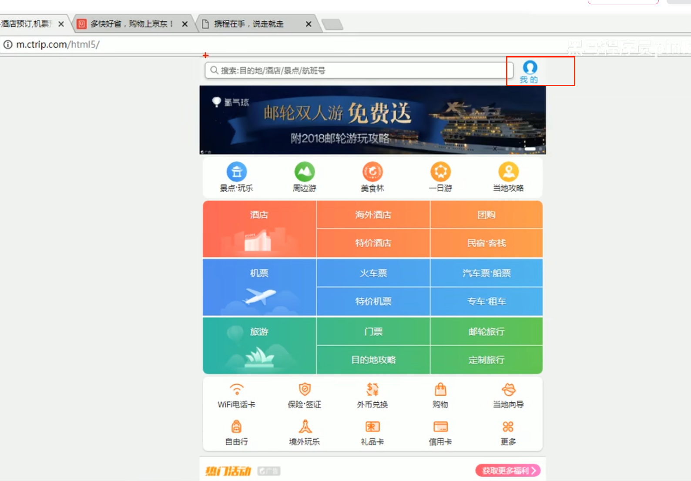

## 标签的选择

结构标签要语义化，不要都用div

## 布局方法：

总体思路：

上下布局：块元素

左右布局：行内元素、行内块、浮动

万能布局：定位、转换

位置调整：margin、padding。【正负值】

> 用多个行内块实现了左右布局后，如果一个行内块的子元素需要上下布局，可以用块元素实现。
>
> 所以，不同布局方式有套娃效果。上下布局内部可以用左右布局，左右布局内部也可以用上下布局

### 1，用标准流做页面布局【页面的垂直布局】

垂直方向对页面做划分，一个块元素占据一行，每行负责不同功能

### 2，用浮动块做行内盒子的布局

每一行内，可以放置多个浮动块。

浮动块：

无法撑满未设置大小的标准流父元素高度，影响后面的标准流的块【覆盖】

【解决：设置父元素的高度，或者设置浮动消除】

### 3，定位

实现更灵活的布局

边距、间隔设置

常用效果：

- 版心块居中：标准流，设置宽度，margin：auto
- 标准块的边距合并问题，通常比如通栏和版心的块与有边距，通过版心块设置上边距会有问题，
  需要用版心的标准块的padding设置边距

一个间隙效果，可能用margin、padding都能实现

怎么实现方便怎么做。

margin：块元素边界重叠【塌陷】问题

padding：块元素已经有宽度，可能导致需要重新计算

元素块默认填满一行

- 不设置宽度，margin、padding不影响盒子大小，
- 否则会扩大盒子

某些块设置了宽度，内容有间隙

一般通过子元素的margin设置间隙。避免重新计算父元素宽度。

浮动消除：子元素浮动块，导致父元素高度为0

## 开发技巧

#### 用浏览器的查看元素，修改属性值，可快速 校准效果

## 最佳实践

### 品优购

base.css 清除边距，input边框

使用css3盒子模型，不用考虑设置padding、border后改变盒子大小问题【box-sizing：borderbox，盒子大小包含padding、border】

用定位控制父子位置

用浮动消除行内元素的边距问题

#### 父子元素的位置排布：

子元素排列简单，比如都在一行上，用浮动做

子元素排列复杂，用定位做

【细节的边距用margin、padding辅助实现】

#### 元素装饰性的细节

一个元素有装饰性的细节，可借助结构伪元素实现

位置比较特殊的细节，可用定位实现

overflowhidden妙用：

对齐换行问题：列表多几个像素导致换行，可以将ul宽度设置大些，并设置hidden子元素。

省略号效果：

PS的使用：

图片自定义剪切：切片工具-另存为图片

辅助线测量：放大图- 标尺-拖拽划线--测量

图层导出：选择工具--图层确认【点击眼睛图标】--右击图层-导出

有些简单的元素组合，尽量不使用浮动、定位，可以更快开发

精灵图：

图片+p元素

padding-top，text-align：center

有些元素列表的边界元素样式有些小区别：

可以通过伪元素选择器：前几个，后几个       

比如：推荐模块，只给前几个通过伪元素设置竖线

### 列表页

上游的line-height溢出，导致下面的文字错位问题：用overflow-hidden解决

hover加border导致抖动问题：通过加一个初始化的透明border解决，并通过设置overflow修复图片溢出遮盖border的问题【牺牲1像素的图片】

## 注册页

让表单错误提示图标对齐文字时，使用了vertical-align，margin

https://juejin.cn/post/6844903561780789255

[**vertical-align** 和 **line-height** 的区别在于：**line-height** 一行垂直居中，而 **vertical-align** 不管有多少行，都能垂直居中。**vertical-align** 属性定义行内元素的基线相对于该元素所在行的基线的垂直对齐，允许指定负长度值和百分比值。**line-height** 是元素中一行文字所占据的高度，如果想要文字在元素内部垂直居中，让 **line-height** 等于元素的 **height** 即可](https://www.cnblogs.com/web-fusheng/p/6601614.html)

### css3特性

#### transform

相对定位也可以实现位置移动，但是相对定位侧重布局，transform侧重动画效果

双面圆反转：另一面不展示

backface-visibility：hidden

## 移动端：

### 流式布局

设置行高为父元素高度，图片较小可以居中【默认与基线对齐】

如果图片较大，则不会居中对齐，需要设置 vertical-align：center，使得大图片与文字中间对齐，才能实现图片居中效果。

品牌日图片上面有间隙【因为行内块基线对齐】：设置vertical-align：top。或者设置display：block。

x号图片设置vertical-align：middle

## Flex布局

相比之前繁琐的布局方式，比如浮动、标准流块等【手动挡汽车】，flex可更快捷的实现布局【自动挡布局】

学习用Flex的主轴、侧轴做布局。

搜索栏的居中：

方式1：不写left，实现固定元素居中【京东做法】

方式2：left：50%，translateX(-50%)  [携程之前做法，现在也和京东一样了]

搜索栏内部：

右侧图标，用了

- 伪元素，转换块元素。

- 精灵图

左侧搜索图标的用伪元素有三种实现方式：

- 使用行内块【用块元素会把右侧文字挤走】
- 浮动
- 定位

文字对齐设置line-height，应该根据content高度来设置。

#### nav制作

需要用边框设置边界效果，css3盒子模型中，只给上面的元素设置边框后，就和相邻的未设置边框的元素内容区不一样大了。但视觉上觉察不到。算是一种牺牲一定的精度，换取简便的开发实现，一种取舍，折中。

父元素圆角设置，配合overflow：hidden

indent：隐藏文字，配合overflow：hidden

